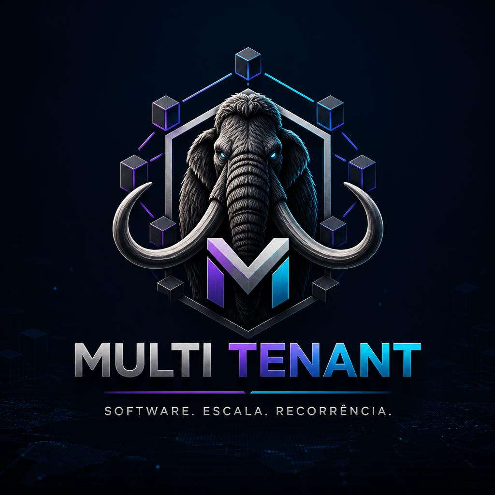

<div align="center">
  
</div>

# Branding — MULTI TENANT

## Posicionamento

A **MULTI TENANT** é uma empresa de tecnologia especializada na criação, operação e crescimento de produtos digitais próprios.

Seu foco não é apenas desenvolver software, mas construir ecossistemas digitais completos que geram receita recorrente através de SaaS, marketplaces, plataformas de assinatura, comunidades, aplicativos, ERPs, CRMs e soluções verticais para diferentes segmentos.

A empresa atua em todo o ciclo de vida do produto:

- Pesquisa e validação de mercado
- Desenvolvimento de software
- Infraestrutura e DevOps
- Marketing e aquisição de usuários
- Operação e suporte
- Evolução contínua
- Escalabilidade
- Monetização

---

# Essência da Marca

### Missão

Transformar ideias em produtos digitais escaláveis, sustentáveis e rentáveis.

### Visão

Tornar-se um dos maiores hubs de produtos digitais da América Latina, operando múltiplos negócios através de uma única estrutura tecnológica.

### Valores

- Inovação contínua
- Escalabilidade
- Eficiência operacional
- Automação
- Simplicidade
- Crescimento sustentável
- Foco em resultado

---

# Conceito da Marca

O nome **MULTI TENANT** vem diretamente de uma das arquiteturas mais poderosas do mundo SaaS:

> Uma única plataforma capaz de servir múltiplos clientes, negócios e mercados simultaneamente.

Esse conceito representa exatamente o modelo da empresa:

Uma estrutura tecnológica central capaz de lançar e operar dezenas de produtos digitais diferentes.

---

# Slogan

### Opções institucionais

**"Criando produtos. Escalando negócios."**

ou

**"Uma plataforma. Múltiplas oportunidades."**

ou

**"Transformando software em receita recorrente."**

ou

**"Do conceito à recorrência."**

ou

**"Construindo o próximo produto digital de sucesso."**

---

# Arquitetura da Marca

```text
MULTI TENANT
│
├── Finance
├── Health
├── Church
├── Education
├── CRM
├── ERP
├── Marketplace
├── Membership
├── AI Products
├── Real Estate
└── Future Ventures
```

Exemplos:

- Multi Tenant Finance
- Multi Tenant Health
- Multi Tenant Church
- Multi Tenant CRM
- Multi Tenant ERP

---

# Proposta de Valor

### Para o mercado

Enquanto outras empresas vendem software sob demanda:

A MULTI TENANT cria, opera e escala seus próprios produtos digitais.

Isso permite:

- Controle total do produto
- Crescimento exponencial
- Receita recorrente
- Menor dependência de projetos
- Escalabilidade global

---

# Personalidade da Marca

### Arquétipo Principal

**O Criador**

Características:

- Inovador
- Visionário
- Construtor
- Estratégico

### Arquétipo Secundário

**O Governante**

Características:

- Estrutura
- Organização
- Controle
- Escala

---

# Identidade Visual

## Direção Visual

Estilo:

- Minimalista
- Tecnológico
- Corporativo
- Premium
- Futurista

Inspirado em:

- Stripe
- Linear
- Vercel
- Atlassian

---

## Paleta de Cores

### Primária

**Midnight Blue**

```css
#0F172A
```

Representa:

- Confiança
- Tecnologia
- Segurança

---

### Secundária

**Electric Purple**

```css
#7C3AED
```

Representa:

- Inovação
- Crescimento
- Futuro

---

### Destaque

**Cyan Tech**

```css
#06B6D4
```

Representa:

- Automação
- Conectividade
- Inteligência

---

### Neutros

```css
#FFFFFF
#F8FAFC
#CBD5E1
#64748B
#1E293B
```

---

# Conceito do Logotipo

### Símbolo

Um conjunto de blocos conectados formando:

- Rede
- Ecossistema
- Plataforma
- Escalabilidade

Representando:

```text
■ ■ ■
 \|/
■ M ■
 /|\
■ ■ ■
```

O "M" central representa a plataforma principal alimentando múltiplos produtos.

---

# Manifesto

> Acreditamos que o futuro pertence às plataformas.
>
> Não criamos apenas sistemas.
>
> Construímos produtos digitais capazes de crescer, evoluir e gerar valor continuamente.
>
> Cada solução lançada fortalece um ecossistema maior.
>
> Cada assinatura recorrente valida uma visão.
>
> Cada nova empresa atendida amplia nossa rede.
>
> Somos uma estrutura tecnológica criada para escalar oportunidades.
>
> Somos a MULTI TENANT.

---

# Pitch Institucional

**MULTI TENANT** é um hub de produtos digitais especializado em criar, operar e escalar plataformas SaaS, marketplaces, aplicativos e soluções de assinatura. Utilizamos uma arquitetura tecnológica compartilhada para lançar produtos em diferentes segmentos de mercado, reduzindo custos operacionais e acelerando o crescimento. Nossa missão é transformar software em ativos digitais de receita recorrente, gerando valor contínuo para usuários, parceiros e investidores.

### Tagline Final

**MULTI TENANT**

### _Software. Escala. Recorrência._ 🚀
